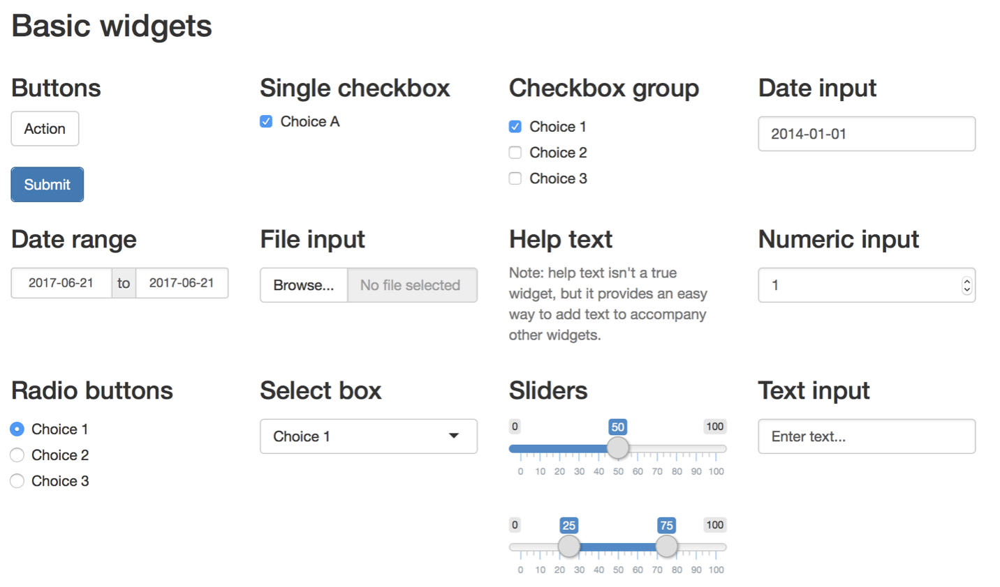
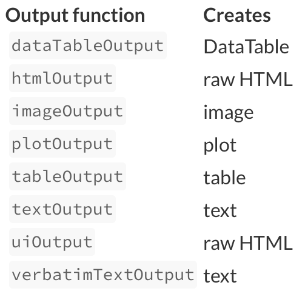
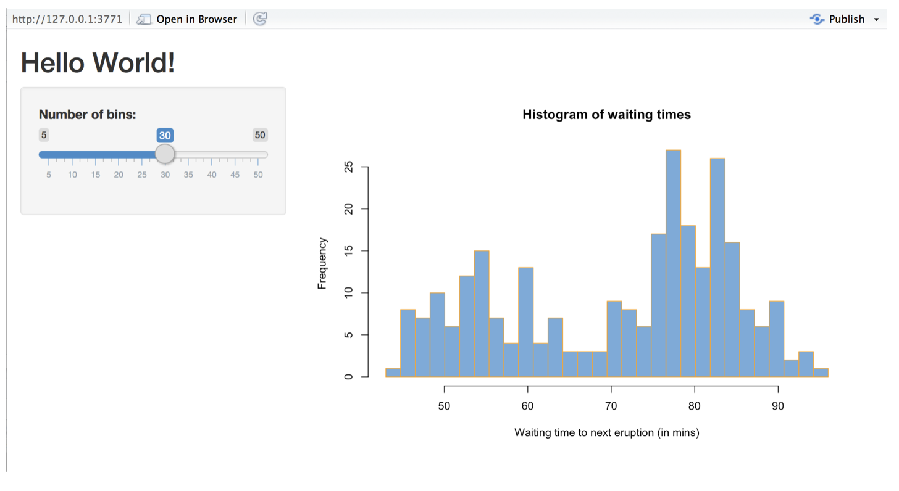

# 直接用R写应用程序 | 基于Shiny的App

R语言是统计学专业学生常用的编程语言。平常，同学们大多用它来跑统计模型或计算。但是，多数同学都不太了解如何用R语言写一些简单的交互式应用程序。有时候，用交互式应用程序来展现分析结果是如何随着数据或参数的变化而变化的，也许会更加直观和清楚。

## 安装和加载Shiny包

与安装其它R包一样，我们可以通过下行命令安装和加载Shiny包。

```r
install.packages("shiny")
library(shiny)
```

## Shiny App 示例

Shiny包中包含11个App演示案例。我们可以通过命令`runExample(NA)`查看所有示例。此处，我们以`runExample("01_hello")`为例。

Shiny App的代码可直接用script写，文件名为`app.R`，其一般包含三个组成部分：一个用户界面对象（user interface object）、一个服务器函数（server function）以及`shinyApp`函数。具体来说，用户界面（`ui`）控制着应用程序的布局和功能设计；`server`函数用来指导计算机如何实现相应的功能；`shinyApp`则是将`ui`和`server`结合起来，最终构建成应用程序。

### Hello Shiny示例中的`ui`函数

```r
library(shiny)

# Define UI for app that draws a histogram ----
ui <- fluidPage(

  # App title ----
  titlePanel("Hello Shiny!"),

  # Sidebar layout with input and output definitions ----
  sidebarLayout(

    # Sidebar panel for inputs ----
    sidebarPanel(

      # Input: Slider for the number of bins ----
      sliderInput(inputId = "bins",
                  label = "Number of bins:",
                  min = 1,
                  max = 50,
                  value = 30)

    ),

    # Main panel for displaying outputs ----
    mainPanel(

      # Output: Histogram ----
      plotOutput(outputId = "distPlot")

    )
  )
)
```
Shiny中有很多layout，最常用的是此处的sidebarLayout。其将Shiny App的布局分为两部分，即sidebarPanel和mainPanel。在sidebarPanel中添加输入端，比如此处的sliderInput表示滑动条。inputId表示变量名，label表示标签，min和max分别表示滑动条的最小值和最大值，value表示默认值。当然，还有其它很多种输入端类型，见下图。



在mainPanel中，我们需要添加输出端。在这个示例中，输出的是图形，用plotOutput表示，outputId表示变量名。常见的输出类型见下图。



### Hello Shiny示例中的`server`函数

```r
# Define server logic required to draw a histogram ----
server <- function(input, output) {

  # Histogram of the Old Faithful Geyser Data ----
  # with requested number of bins
  # This expression that generates a histogram is wrapped in a call
  # to renderPlot to indicate that:
  #
  # 1. It is "reactive" and therefore should be automatically
  #    re-executed when inputs (input$bins) change
  # 2. Its output type is a plot
  output$distPlot <- renderPlot({

    x    <- faithful$waiting
    bins <- seq(min(x), max(x), length.out = input$bins + 1)

    hist(x, breaks = bins, col = "#75AADB", border = "white",
         xlab = "Waiting time to next eruption (in mins)",
         main = "Histogram of waiting times")

    })

}
```
Shiny的`server`函数则是将input的变量和其他数据通过某种运算，得到output所要输出的变量。输出的内容会随着input的改变而改变。比如，在此例中，input表示直方图的bins数目，其它数据是`faithful$waiting`，output则是直方图。

### 运行App

在运行完`ui`和`server`两个函数之后，只需要最后再运行`shinyApp(ui=ui, server=server)`则可看到App界面。本示例中的App界面如下。



除此之外，我们可以将`app.R`放在一个文件夹中，如命名为my_app，然后将my_app文件夹放在R的工作目录中，然后执行`runApp("my_app)`即可运行App。但要注意的是，如果App中需要用到图片，则需要将图片保存在名为www的文件夹中，并将www文件夹与`app.R`存放在同一级目录中。

## 分享你的App

总体来说，我们能够以R script的方式活着网页的方式来和别人分享我们的App。具体可以参考[Shiny.Rstudio](https://shiny.rstudio.com/tutorial/written-tutorial/lesson7/)上的介绍。

- 以R script的方式分享时，我们只需将包含`app.R`
的整个文件包发送出去。只要对方的电脑上安装了R，那么就可以运行R script，并最终看到App。

- 以网页方式分享时，我们最常用的是用[shinyapp.io](https://www.shinyapps.io)所提供的服务。注册账号后，将App上传到服务端，最后就可以通过简单的链接将Shiny App分享出去。

## 其它

Shiny中还有一类重要的表达式，即reactive expressions，它能够帮助控制App的哪些部分在何时更新，这可以防止不必要的计算，从而提高App的运行速度。这部分将在今后的文章中继续分享。

## 参考文献

https://shiny.rstudio.com

